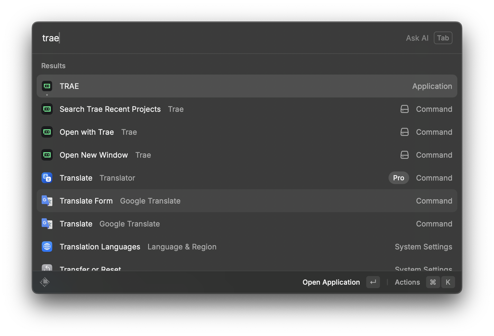

# Trae

Control [Trae](https://trae.app) directly from Raycast - A powerful code editor built on open-source foundations.

[![raycast-cross-extension-badge]][raycast-cross-extension-link]



## Features

This extension provides three powerful commands to streamline your workflow with Trae:

### 1. Search Trae Recent Projects
Quickly search and open your recently accessed projects in Trae. Features include:
- 🔍 **Fast Search**: Instantly filter through your recent projects
- 🌿 **Git Branch Display**: See the current git branch for each project at a glance
- 📁 **Multiple Actions**: Open in Trae, reveal in Finder, or copy the project path
- ⚡ **Real-time Updates**: Automatically detects projects opened via CLI (`trae .`) or through the extension
- 🕐 **Last Accessed Time**: View when you last worked on each project

### 2. Open with Trae
Open the currently selected folder from Finder or Path Finder directly in Trae:
- Works with both **Finder** and **Path Finder**
- Supports multiple folder selections
- Automatically tracks opened projects for quick access later

### 3. Open New Window
Quickly open a new empty window in Trae:
- Multiple fallback strategies ensure it works reliably
- Starts with a clean workspace ready for your next project

## Screencast

### Search Trae Recent Projects


### Open with Trae


### Open New Window


## Requirements

- [Trae](https://trae.app) application installed on your Mac
- macOS (this extension is designed specifically for macOS)

## Installation

Install this extension from the [Raycast Store](https://raycast.com/vinzzztty/trae).

## Configuration

After installation, you can configure:
- **Trae Application**: Select your Trae app location (default: `/Applications/Trae.app`)
- **Projects Root Directory**: Set the root folder for project scanning (default: `~/Projects`)

## API

This extension follows [Raycast Cross-Extension Conventions][raycast-cross-extension-link].

You can use `crossLaunchCommand` to launch its commands from other extensions.

### Launch Example

```js
import { LaunchType, open } from "@raycast/api";
import { crossLaunchCommand } from "raycast-cross-extension";

await crossLaunchCommand({
  name: "search-trae-recent-projects",
  extensionName: "trae",
  ownerOrAuthorName: "vinzzztty",
  type: LaunchType.UserInitiated,
}).catch(() => {
  // Open the store page if the extension is not installed
  open("raycast://extensions/vinzzztty/trae");
});
```

## Development

```bash
# Install dependencies
npm i

# Start local development server
npm run dev

# Lint and fix
npm run fix-lint

# Build the extension
npm run build
```

[raycast-cross-extension-badge]: https://shields.io/badge/Raycast-Cross--Extension-eee?labelColor=FF6363&logo=raycast&logoColor=fff&style=flat-square
[raycast-cross-extension-link]: https://github.com/LitoMore/raycast-cross-extension-conventions
